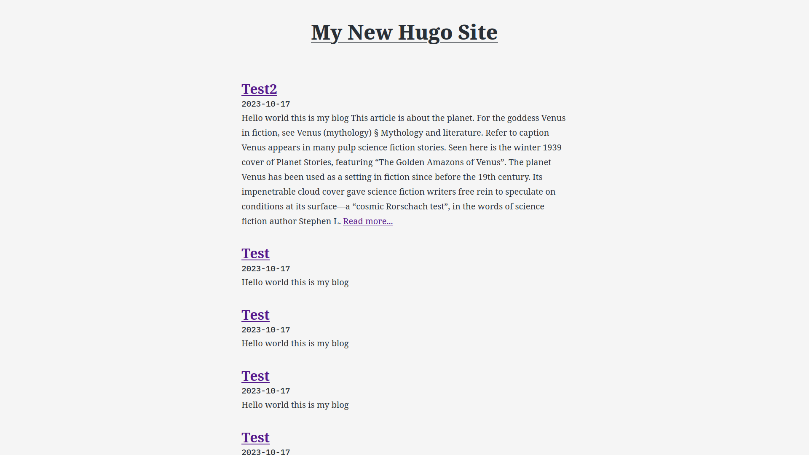

# Springbok
A simple hugo blog theme based on [blank](https://github.com/vimux/blank)




## Installation

In your Hugo site `themes` directory, run:

```
git clone https://github.com/charyan/springbok
```

Next, open `hugo.toml` in the base of the Hugo site and ensure the theme option is set to `springbok`.

```
theme = "springbok"
```


## License

This theme is released under the [MIT license](https://github.com/charyan/springbok/blob/master/LICENSE).
