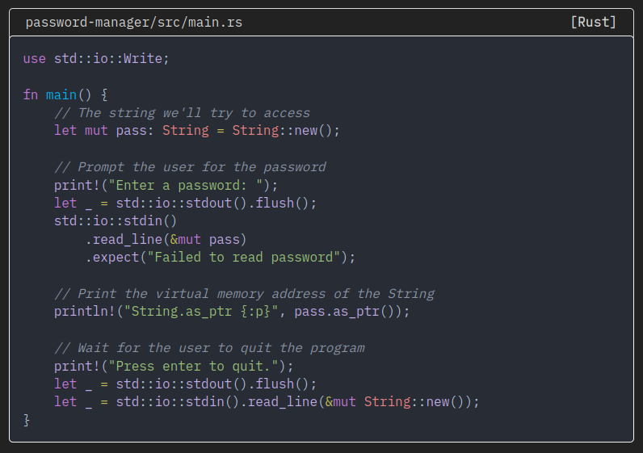

# Springbok
A simple hugo blog theme based on [blank](https://github.com/vimux/blank)


## Installation

In your Hugo site `themes` directory, run:

```
git clone https://github.com/charyan/springbok
```

Next, open `hugo.toml` in the base of the Hugo site and ensure the theme option is set to `springbok`.

```
theme = "springbok"
```

## Features
### Home Page
The home page shows the name of the site, a list of posts with their name and tags. In the footer, we have the following links: home, tags and about.

### Single Post


We can add the following parameters in the YAML front matter:
* **lastmod** : Last update to the post, shown only if different than date
* **author** : shown if set
* **type** : if set to "special", will not show reading time, post date, update date and author

### Tags Page
The tags page show all tags used in the posts in alphabetical order.


### About page
Create `about.md` in your hugo site's `content` directory. The page must have the parameter `type` set to `special`.

```
+++
title = "About"
type = "special"
+++

Hello, this is my about page.

```

### Shortcodes
#### Filename
The filename shortcode can be used to add a filename and a language to a code block. It works with markdown code blocks and the highlight shortcode.

The first parameter is the filename and the second (optional) is the language.
```
usage: 
```
#### Examples
Markdown code block with language
````cpp

```cpp
#include <iostream>

int main() {
  std::cout << "Hello World!" << std::endl;
  return 0;
}
```
````



Highlight shortcode
````cpp


#include <iostream>

int main() {
  std::cout << "Hello World!" << std::endl;
  return 0;
}

````


To create a code block with a language but no filename, you can use an empty string.
`{< filename "" "C++" >}`


### Katex
[KaTeX](https://katex.org/) is used to render TeX on each page. See `layouts/partials/katex.html` and the [KaTeX documentation](https://katex.org/docs/api) for more.

## License

This theme is released under the [MIT license](https://github.com/charyan/springbok/blob/master/LICENSE).
